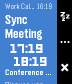
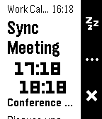
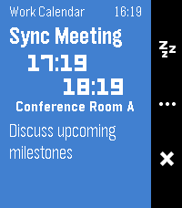

# Pebble Flexible Alerts

  

Show alerts for your Android calendars, contact birthdays, and anniversaries.
Allows you to add reminders to subscribed calendars or events without built-in
reminders, which is great for ICS subscriptions like holidays and private work
calendars. Requires an Android companion app to function.

Currently only supports basalt, diorite, and emery. The UI doesn't correctly
display on aplite and round watchfaces.

This app not yet published on the Pebble store F-Droid, but you can sideload it
from one of the releases or build it yourself.

Androidのカレンダーや、連絡先に登録された誕生日・記念日のアラートを表示します。
リマインダー機能がないカレンダーやイベントにもアラートを追加できるため、祝日やプ
ライベートな仕事用カレンダーなどのICSサブスクリプションに最適です。日本語にも完
全対応しています。このアプリを使うにはAndroidコンパニオンアプリが必要です。

現在、basalt、diorite、emeryのみ対応しています。apliteや丸型のウォッチフェイスで
は、UIが正しく表示されません。

このアプリはまだPebbleストアやF-Droidでは公開されていませんが、リリースからサイ
ドロードするか、自分でビルドすることができます。
